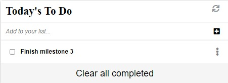

# To Do list

"To-do list" is used to lists the things that you need to do and allows you to mark them as complete. 
This is built using ES6 and Webpack!

## Built With 🔨

- JavaScript
- HTML
- CSS
- Webpack
- Visual Studio Code
- Git & Github
## Live Demo

[Live Demo Link](https://fondem-jr.github.io/To-Do-list-list-structure/dist/)
## Getting Started

👤 **Fondem Junior**

 - [Github](https://github.com/Fondem-Jr)
 - [Linkedin](https://www.linkedin.com/in/fondem-junior-57484744/)
 - [Twitter](https://twitter.com/OpportunistZeus)

### Install

To get a local copy up and running follow these simple example steps.
- Open terminal
- Clone this project by the command `git clone git@github.com:Fondem-Jr/To-Do-list-list-structure.git`
- `cd <clone>` folder
- Run `npm start` in your local browser or using Live Server in Visual Studio Code.

### Prerequisites

- IDE to edit and run the code (We use Visual Studio Code 🔥).
- [Node.js](https://nodejs.org/en/download/) already downloaded.
- Webpack - [click here to getting started](https://webpack.js.org/guides/getting-started/).

### Usage

- Practice Webpack skills.
- Manage files using Webpack.

## 🤝 Contributing

Contributions, issues, and feature requests are welcome!

## Show your support

Give a ⭐️ if you like this project!

## Acknowledgments

- Hat tip to anyone whose code was used 🔰
- Inspiration 💘
- Microverse program ⚡
- Our standup team 🏹
- Our family's support 🙌

## 📝 License

This project is [MIT](./LICENSE) licensed.
